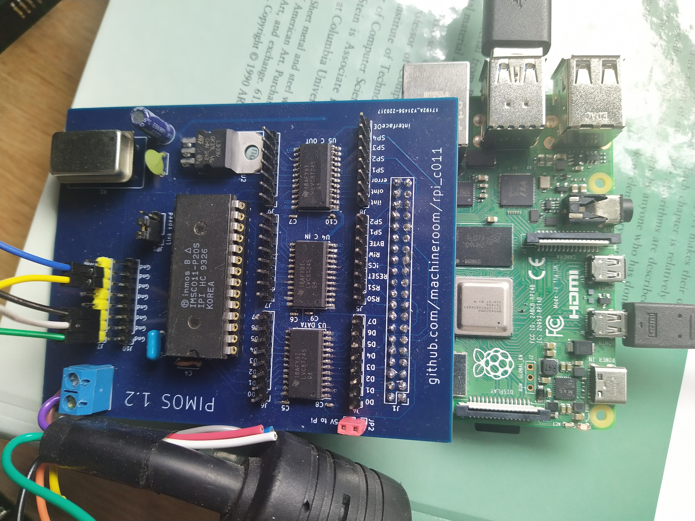

C011 based Transputer link interface for Raspberry Pi. Loopback performance with 20Mbps link on Rpi4 is ~11Mbps

**POWER IS CRITICAL! without good 3V3 and 5V feeds to the TXS0108 suffer random power drops for certain byte values...**

**Also critical is short connection between c011 and Pi else TXS0108 glitch and go into reverse drive occasionally. AVOID ribbon cables!**
